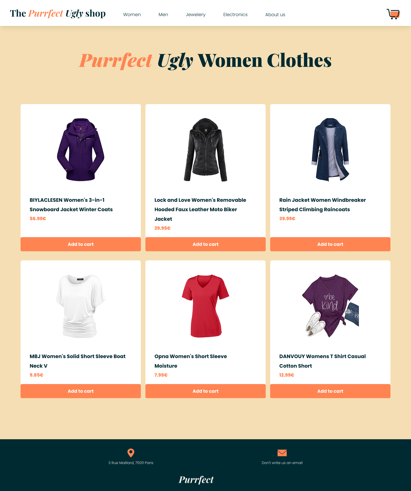
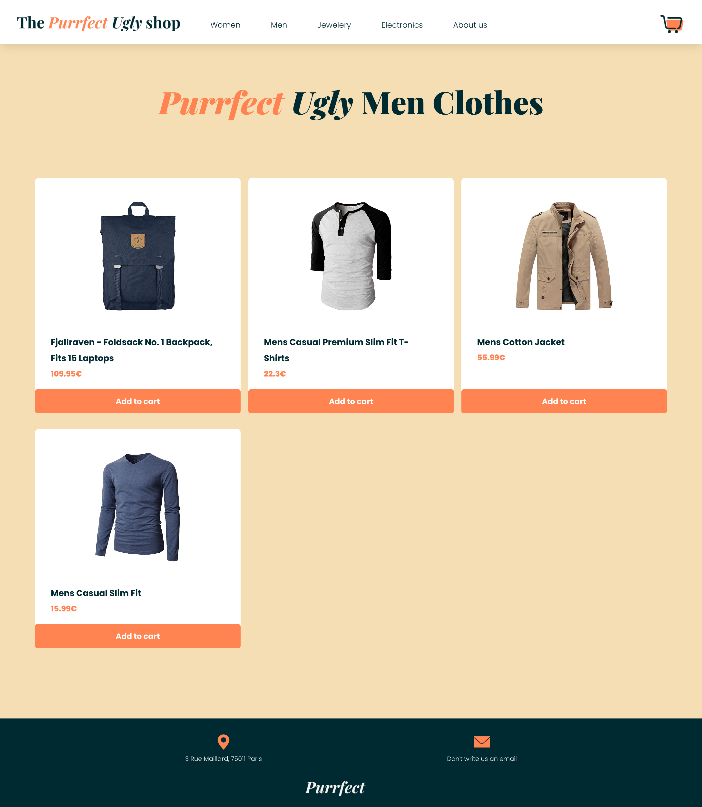
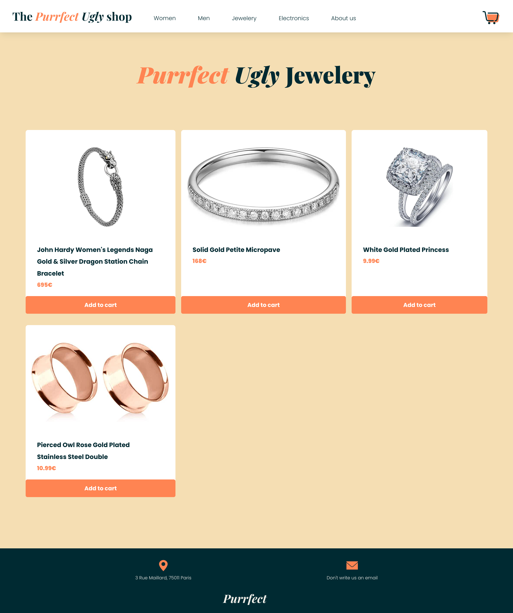
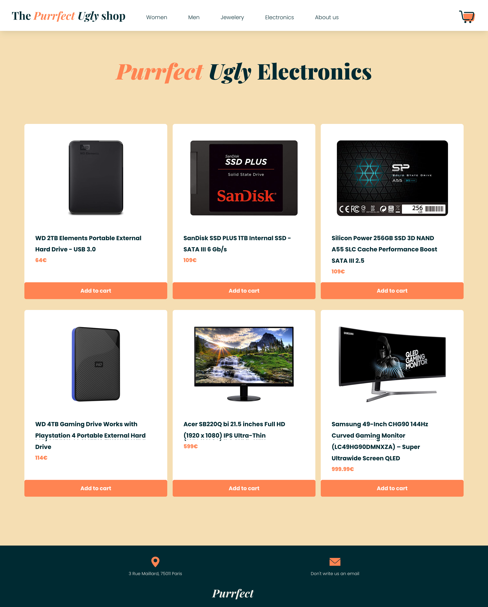
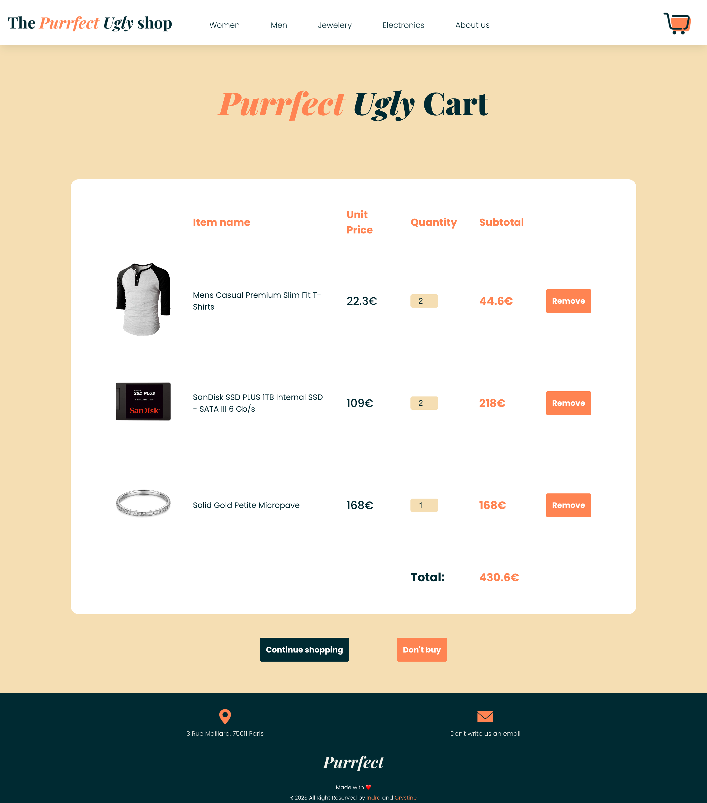
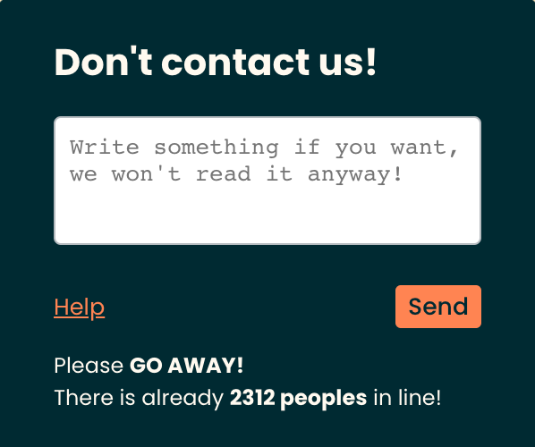

# Purrfect Ugly Shop

This is a web application called "Purrfect Ugly Shop" built with React. It is an e-commerce platform where users can browse and purchase various products. The application includes different pages, such as Home, About, AllWomen, AllMen, AllJewelery, AllElectronics, ProductDetails, and Cart.

## Table of Contents

- [Usage](#usage)
- [Dependencies](#dependencies)
- [File Structure](#file-structure)
- [App Overview](#app-overview)

## Usage

Once the application is running, open a web browser and navigate to the following URL:

https://the-purrfect-ugly-shop.netlify.app/

You will be redirected to the home page of the Purrfect Ugly Shop. From there, you can navigate to different pages using the navigation bar.

- Women: Browse and purchase women's products.
- Men: Browse and purchase men's products.
- Jewelery: Browse and purchase jewelery products.
- Electronics: Browse and purchase electronics products.
- About us: Learn more about the Purrfect Ugly Shop.

You can add products to the cart by clicking the "Add to Cart" button on the product details page. The cart page displays the selected items, allowing you to adjust the quantity or remove items from the cart.

## Dependencies

The following dependencies are used in this project:

- react: JavaScript library for building user interfaces.
- react-router-dom: Routing library for React applications.
- axios: Promise-based HTTP client for making API requests.
- react-dom: Entry point of the React application.
- react-scripts: Configuration and scripts for Create React App.

## File Structure

The codebase is organized as follows:

- src/
  - App.js: The main component that sets up the routing for different pages.
  - Pages/: Contains the components for different pages, such as Home, About, AllWomen, AllMen, AllJewelery, AllElectronics, ProductDetails, and Cart.
  - Components/: Contains reusable components used in the application, such as NavbarAndFooterAndContactTooltip.
  - Assets/: Contains image assets used in the application.

## App Overview

## Home Page

This page displays the promotion banner and all the products on the website.

## Women Page

Page that content all the women products.

## Men Page

Page that content all the men products.

## Jewelery Page

Page that content all the jeweleries.

## Electronic Page

Page that content all the electronics.

## Product Details Page

This page displays the details of the Product which user has selected from the products list page. Here, the user can see all the info of the Product such as product name, description.

## Cart Page

## Don't contact us Page

This page is a joke, just to mess with you.

